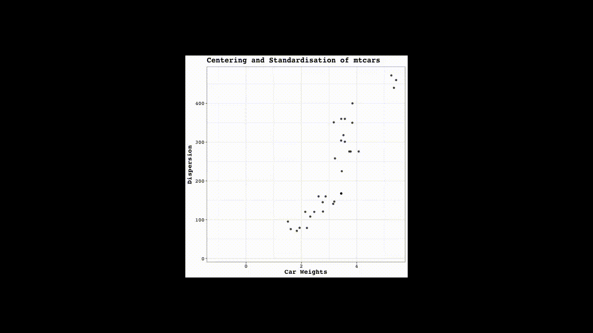
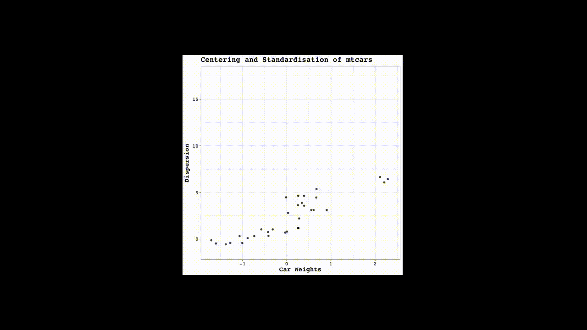
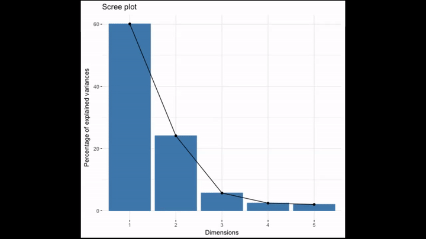

```{r setup, include=FALSE}
knitr::opts_chunk$set(echo = TRUE)
```

Muitas vezes no aprendizado de máquina o objetivo é encontrar padrões nos dados sem tentar fazer previsões, isso é chamado de aprendizagem não supervisionada. É comum usar a aprendizagem não supervisionada para agrupar consumidores com base em dados demográficos e histórico de compras para campanhas de marketing direcionadas. Outro exemplo é querer descrever os fatores não medidos que mais influenciam as diferenças entre cidades. Este tutorial é uma introdução básica às técnicas de cluster e redução de dimensionalidade em R a partir de uma perspectiva de aprendizado de máquina.

## 1) k-means

O algoritmo k-means é amplamente usado para realizar a tarefa de cluster nos dados (cluster = "agrupamento" em português). Problemas que demandam realizar clusters são:
* Determinar agrupamentos de casas para venda com base no tamanho, número de quartos, etc;
* Determinar se há padrões comuns de demografia de pessoas para um segmento do mercado;

Vou usar o dataset "x" no qual possui duas dimensões que usarei para criar um modelo de k-means usando 3 clusters, em seguida examinarei a estrutura do modelo resultante usando a função summary().

```{r, message=FALSE, warning=FALSE}

# carregando os dados
library(readxl) # pacote necessário para ler o arquivo
x <- read_xlsx("x.xlsx", sheet = 1)

# criando o modelo de k-means: km.out
km.out <- kmeans(x, centers = 3, nstart = 20)

# verificando o modelo
summary(km.out)

```

A função kmeans() produz várias saídas. A seguir, acessarei a componente do cluster diretamente. Isso é útil sempre que você precisar da associação de cluster para cada observação dos dados usados para construir o modelo de armazenamento em cluster. Mais adiante mostrarei um exemplo de como essa associação de cluster pode ser usada para ajudar a comunicar os resultados da modelagem k-means.

Nos modelos k-means é possível visualizarmos os resultados da modelagem usando a função print() ou simplesmente digitando o nome do modelo.

```{r, message=FALSE, warning=FALSE}

# visualizando a componente de cluster
km.out$cluster

# visualizando a saída do modelo
km.out

```

 ### 1.1) Visualizando clusters

Uma das maneiras mais intuitivas de interpretar os resultados dos modelos k-means é plotando os dados como um gráfico de dispersão e usando cores para rotular a associação de cluster das amostras. Vou usar a função plot() padrão para realizar isso.

```{r, message=FALSE, warning=FALSE}

# gráfico de dispersão x
plot(x, col = km.out$cluster,
     main = "k-means with 3 clusters", 
     xlab = "", ylab = "")

```

### 1.2) Aleatoriedade do algoritmo k-means

A função kmeans() gera aleatoriamente os centros de clusters, essa aleatoriedade pode resultar em diferentes cluster a cada vez que executar o modelo. Além disso, essa geração aleatória pode resultar em diferentes locais mínimos para o algoritmo k-means. A seguir vou demonstrar os dois resultados.

No topo de cada gráfico, a medida da qualidade do modelo será plotada, assim podemos ver os modelos com os melhores resultados.

Como o kmeans() gera as observações para clusters aleatoriamente, é importante definir o gerador de números aleatórios para podermos reproduzir o resultado do modelo.


```{r, message=FALSE, warning=FALSE}

# configurando a grade de 2x3
par(mfrow = c(2, 3))

# para reprodução dos resultados do modelo
set.seed(1)

for(i in 1:6) {
  # rodando o kmeans() com 3 clusters 1 começo
  km.out <- kmeans(x, centers = 3, nstart = 1)
  # visualizando os clusters
  plot(x, col = km.out$cluster, 
       main = km.out$tot.withinss, 
       xlab = "", ylab = "")
}

```

Por conta da geração aleatória do algoritmo k-means, há bastante variação entre as métricas de qualidade do cluster entre os seis modelos.

### 1.3) Selecionando o número de clusters

O algoritmo k-means assume o número de clusters como parte do input. Se você souber antecipadamente o número de clusters (por exemplo, devido a certas características do negócio), isso facilita a configuração do número de clusters. No entanto, se não souber o número de clusters e precisar determiná-lo, será necessário executar o algoritmo várias vezes, cada vez com um número diferente de clusters. A partir disso, você pode observar como a métrica da qualidade do modelo muda com o número de clusters.

A seguir vou executar o kmeans() várias vezes para ver como a qualidade do modelo é alterada conforme o número de clusters é alterado. Os gráficos que exibem essas informações ajudam a determinar o número de clusters e são geralmente chamados de scree plot.

O ideal é visualizar um cotovelo onde a métrica de qualidade melhora mais lentamente à medida que o número de agrupamentos aumenta. Isso indica que a qualidade do modelo não está mais melhorando substancialmente à medida que a complexidade do modelo (ou seja, o número de clusters) aumenta. Em outras palavras, o cotovelo indica o número de clusters inerentes aos dados.

```{r, message=FALSE, warning=FALSE}

# começando com a soma total dos erros ao quadrado: wss
wss <- 0

# de 1 a 15 centros de cluster
for (i in 1:15) {
  km.out <- kmeans(x, centers = i, nstart = 20)
  # salvando a soma total dos quadrados no objeto wss
  wss[i] <- km.out$tot.withinss
}

# visualizando a soma total dos quadrados X o número de clusters
plot(1:15, wss, type = "b", 
     xlab = "Number of Clusters", 
     ylab = "Within groups sum of squares")

# configurando o k
k <- 2  # 3 também seria ok

```

Olhando para o scree plot parece que existem 2 ou 3 clusters nos dados.

### 1.4) Trabalhando com dados reais

Lidar com dados reais costuma ser mais desafiador do que lidar com dados sintéticos. Os dados sintéticos ajudam a aprender novos conceitos e técnicas, mas a seguir vamos lidar com dados mais reais, no qual podemos encontrar em nossas atividades profissionais ou acadêmicas.

Usarei aqui os dados do Pokemon disponível no site do kaggle. O primeiro desafio com os dados do Pokemon é que não há um número pré-determinado de clusters. Você determinará o número apropriado de grupos, tendo em mente que, em dados reais, o cotovelo do scree plot pode ser saliente do que em dados sintéticos. Use seu julgamento para determinar o número de clusters se quiser.

Uma observação adicional: este exercício utiliza o argumento iter.max para kmeans(). Como você viu, kmeans() é um algoritmo iterativo, repetindo várias vezes até que algum critério de parada seja atingido. O número padrão de iterações para kmeans() é 10, o que não é suficiente para o algoritmo convergir e atingir seu critério de parada, portanto, definiremos o número de iterações como 50 para superar esse problema. Para ver o que acontece quando o kmeans() não converge, tente executar o exemplo com um número menor de iterações (por exemplo, 3). Este é outro exemplo do que pode acontecer quando você trabalha com dados reais.

```{r, message=FALSE, warning=FALSE}

# importando os dados do pokemon
pokemon <- read.csv("Pokemon.csv", sep = ",")
pokemon1 <- pokemon[,6:11]

# começando com a soma total dos erros ao quadrado: wss
wss <- 0

# de 1 a 15 centros de cluster
for (i in 1:15) {
  km.pokemon <- kmeans(pokemon1, centers = i, nstart = 20, iter.max = 50)
  # salvando a soma total dos quadrados no objeto wss
  wss[i] <- km.pokemon$tot.withinss
}

# visualizando a soma total dos quadrados X o número de clusters
plot(1:15, wss, type = "b", 
     xlab = "Number of Clusters", 
     ylab = "Within groups sum of squares")

# selecionando o número de clusters (pode ser 2, 3 ou 4...)
k <- 3

# construindo o modelo com k clusters: km.out
km.pokemon <- kmeans(pokemon1, centers = k, nstart = 20, iter.max = 50)

# visualizando os resultados do modelo
km.pokemon

# visualizando os clusters de defesa X velocidade
plot(pokemon[, c("Defense", "Speed")],
     col = km.pokemon$cluster,
     main = paste("k-means clustering of Pokemon with", k, "clusters"),
     xlab = "Defense", 
     ylab = "Speed")

```

## 2) Clustering hierárquico

O clustering hierárquico é outro método popular de clustering. O objetivo deste capítulo é mostrar como ele funciona, como usá-lo e como ele se compara ao k-means.

### 2.1) Modelo simples de clustering hierárquico

A seguir vou criar o nosso primeiro modelo de clustering hierárquico usando a função hclust(). Usarei o dataset "z" para criar um modelo de clustering hierárquico. O primeiro passo para o modelo de clustering hierárquico é determinar a similaridade entre observações, usando a função dist(). Ao final vou examinar a estrutura do modelo resultante usando a função summary().


```{r, message=FALSE, warning=FALSE}

# carregadno o dataset z
z <- read_xlsx("z.xlsx", sheet = 1)

# criando o modelo de clustering hierárquico
hclust.out <- hclust(dist(z))

# verificando os resultados
summary(hclust.out)

```

Agora que criamos nosso primeiro modelo de clustering hierárquico, vamos aprender como usá-lo para resolver problemas.

### 2.2) Podando a árvore

Usaremos a função cutree() que corta horizontalmente o modelo hierárquico. Os argumentos h e k do cutree() permitem cortar a árvore com base em uma certa altura h ou com um determinado número de clusters k. A seguir vou usar o cutree() para cortar o modelo hierárquico criado anteriormente com base em cada um desses dois critérios.

```{r, message=FALSE, warning=FALSE}

# podando pela altura
cutree(hclust.out, h = 7)

# podando pelo número de clusters
cutree(hclust.out, k = 3)

```

Se você está se perguntando o que significa esse output, lembre-se, existem 50 observações no dataset x. O output do cutree() representa as atribuições de cluster para cada observação no dataset original ;)

### 2.3) Métodos de ligação

Agora vou explorar modelos de clustering hierárquico usando diferentes métodos de ligação e vou plotar o dendrograma de cada um, para observarmos a estrutura geral das árvores.

```{r, message=FALSE, warning=FALSE}

# cluster usando a ligação "complete"
hclust.complete <- hclust(dist(z), method = "complete")

# cluster usando a ligação "average"
hclust.average <- hclust(dist(z), method = "average")

# cluster usando a ligação "single"
hclust.single <- hclust(dist(z), method = "single")

# plotando o dendograma que usa a ligação "complete"
plot(hclust.complete, main = "Complete")

# plotando o dendograma que usa a ligação "average"
plot(hclust.average, main = "Average")

# plotando o dendograma que usa a ligação "single"
plot(hclust.single, main = "Single")

```

Antes de continuarmos, verifique os gráficos para comparar os três dendrogramas, vou explicar a seguir sobre as implicações dessas diferenças!

É visível que as ligações "complete" e "average" produzem clusters mais equilibrados. Ter árvores balanceadas ou não balanceadas para seu modelo hierárquico de clustering, vai depender do contexto do problema que você está tentando resolver. Árvores equilibradas são essenciais se você quer um número par de observações atribuídas a cada cluster. Por outro lado, se você quiser detectar valores discrepantes por exemplo, uma árvore desequilibrada é mais adequada porque a remoção de uma árvore não balanceada pode resultar na maioria das observações atribuídas a um cluster, e apenas algumas observações atribuídas a outros clusters.

### 2.3) Questões práticas: dimensionamento

Lembre-se de que os dados reais em cluster podem exigir o dimensionamento dos recursos se eles tiverem distribuições diferentes. Até agora, trabalhei com dados sintéticos que não precisam de escalonamento.

A seguir voltarei a trabalhar com dados reais, usarei o dataset pokemon novamente. Vamos observar a distribuição (média e desvio
padrão) de cada recurso, dimensionar os dados de acordo, e em seguida produzir um modelo de agrupamento hierárquico usando o método de ligação completo. 

```{r, message=FALSE, warning=FALSE}

# verificando a média das colunas do dataset
colMeans(pokemon[6:11])

# verificando o desvio padrão das compenentes do dataset
apply(pokemon[6:11], 2, sd)

# escalonando os dados
pokemon.scaled <- scale(pokemon[6:11])

# criando o modelo de clustering hierárquico
hclust.pokemon <- hclust(dist(pokemon.scaled), method = "complete")

```

Vamos rapidamente recapitular o que acabei de fazer: 1) Verifiquei primeiro se as médias das colunas e os desvios padrão variam; 2) Por causa disso, escalei os dados; 3) Converti os dados escalados para uma matriz de similaridade e as passei para a função hclust()

### 2.4) Comparando kmeans() e hclust()

Agora vou comparar o k-means e o clustering hierárquico, vamos ver como esses dois métodos produzem diferentes associações de cluster. Isso ocorre porque os dois algoritmos fazem suposições diferentes sobre como os dados são gerados. A seguir vou comparar os resultados dos dois modelos do dataset pokemon para ver como eles são diferentes.

```{r, message=FALSE, warning=FALSE}

# aplicando a função cutree() no hclust.pokemon
cut.pokemon <- cutree(hclust.pokemon, k = 3)

# comparando os métodos
table(km.pokemon$cluster, cut.pokemon)

```

Olhando para a tabela, parece que o modelo de clustering hierárquico atribui a maioria das observações ao cluster 1, enquanto o algoritmo k-means distribui as observações de forma relativamente uniforme entre todos os clusters. É importante notar que não há consenso sobre qual método produz melhores clusters. O trabalho do analista para o clustering não supervisionado é observar as atribuições do cluster e fazer uma avaliação de quanto cada método fornece mais insights sobre os dados!

## 3) Redução de dimensionalidade com PCA

Trabalhando como cientista de dados, frequentemente você terá que lidar com datasets desordenados e com alta dimensão. A seguir mostrarei como usar a  PCA (Principal Component Analysis) para reduzir efetivamente a dimensionalidade desses tipos de datasets, de modo que fique mais fácil extrair insights deles.

Bom, mas o que a PCA faz?

* 1) a PCA permite remover o ruído causado pela correlação entre as variáveis, na prática ela decompõe a matriz de correlação;

* 2) a PCA muda as o sistema de coordenadas original e estabelece novas dimensões no qual são chamdas de **componentes principais**;

* 3) e por último a PCA revela a verdadeira dimensionalidade dos dados, na prática a PCA nos ajuda reduzindo o número de dimensões;

Conceitualmente existem 5 passos para realizar a PCA:

A (1) centralização e a (2) padronização são duas etapas necessárias na fase de pré-processamento, a (3) rotação e a (4) projeção expressam a mudança no sistema de coordenadas para um novo sistema de coordenadas com as componentes principais nos seus eixos, e finalmente, nós podemos (5) reduzir a dimensionalidade dos dados baseada na variância explicada das componentes principais.  

A centralização e padronização essencialmente movem os dados para diferentes posições dentro do mesmo sistema de coordenadas, no entanto, deixando a forma da nuvem de pontos inalterada:

<center>

</center>

Os próximos dois passos implementam a mudança de perspectiva das variáveis originais para as componentes principais, cada um dos novos componentes extraídos é ortogonal ao anterior, e por fim acabaremos com uma nova representação não-reduzida dos dados, em que os eixos x e y correspondem aos dois primeiros componentes principais extraídos:

<center>

</center>

Reduzir a dimensionalidade dos dados envolve uma decisão sobre quais das novas dimensões podemos manter e ainda explicar a maior parte da variação. O scree plot é um gráfico que coloca as componentes principais recém extraídas em ordem decrescente com base na porcentagem de variância explicada. Quase 85% da variação nos dados originais é explicada pelos dois primeiros componentes. Isso é um bom sinal, pois usar apenas duas das onze dimensões do dataset mtcars nos deixa mais tranquilo em relação a perda de informação.

<center>

</center>

O R possui a função prcomp() para realizar a PCA sobre os dados, o output dessa função contém um índice com a carga das variáveis. Como exemplo usarei um mtcars para demonstrar:

```{r, message=FALSE, warning=FALSE}

# PCA com prcomp()
mtcars_pca <- prcomp(mtcars)
mtcars_pca

```

O pacote FactorMineR que nós usaremos nesse tutorial oferece a coleção mais completa de métodos de extração/estimativa para PCA, a função PCA() usa um conjunto de dados ou matriz de correlação e gera dois gráficos e uma série de índices informativos para cinco dimensões. A PCA(), ao contrário de prcomp(), não retorna as cargas, mas as coordenadas das variáveis na nova representação de dados.  

```{r, message=FALSE, warning=FALSE}

# carregando o FactorMineR
library(FactoMineR)

# PCA com PCA() do FactorMineR
mtcars_pca <- PCA(mtcars)
mtcars_pca

```

Agora vamos nos concentrar no mapa de fatores da variável para interpretar o modelo de PCA. Na primeira componente principal (eixo horizontal), variáveis como cyl (número de cilindros), wt (peso) e disp (deslocamento em polegadas cúbicas) possuem valores positivos e estão localizadas na extremidade direita, enquanto mpg (milhas por galão) fica no lado exatamente oposto, tendo valores negativos. Uma explicação plausível é que a primeira componente principal separa carros que são "potentes e pesados" do lado direito, daqueles que são "econômicos e leves" no lado esquerdo. A segunda componente principal parece revelar outra característica oculta do dataset mtcars relacionada a velocidade. Os carros com muitas marchas são colocados mais ao alto, enquanto os mais lentos, que têm valores mais altos para qsec (1/4 de milha), possuem valores mais baixos na segunda componente principal.

A propriedade *eig* da PCA() gera uma matriz com três colunas, sendo as mais importantes as porcentagens de variância explicada e variância acumulada explicada pelos componentes principais. 

```{r, message=FALSE, warning=FALSE}

mtcars_pca$eig

```

*cos2* significa cosseno ao quadrado e é um índice para a qualidade de representação de variáveis e indivíduos, quanto mais próximo este valor for de um, melhor será a qualidade.

```{r, message=FALSE, warning=FALSE}

mtcars_pca$var$cos2

```

O *mtcars_pca$var$contrib* demonstra as contribuições em porcentagem de todas as variáveis na determinação da componente principal, enquanto a função *dimdesc()* mostra as variáveis mais correlacionadas às primeiras componentes principais.

```{r, message=FALSE, warning=FALSE}

mtcars_pca$var$contrib

dimdesc(mtcars_pca)

```

Legal, agora estamos prontos para aplicar tudo isso em outro dataset!

### 3.1) PCA com FactoMineR

Como vimos anteriormente, o FactoMineR é um pacote muito útil, rico em funcionalidades, que implementa vários métodos de redução de dimensionalidade. Sua função para fazer a PCA é PCA(). Lembre-se que a PCA(), por padrão, gera 2 gráficos e extrai os 5 primeiras componentes principais. Você pode usar o argumento ncp para definir manualmente o número de dimensões a serem mantidas.

Você também pode usar a função summary() para obter uma rápida visão geral dos índices das três primeiras componentes principais. Além disso, para extrair sumários de algumas das linhas em um conjunto de dados, você pode especificar o argumento nbelements.

```{r, message=FALSE, warning=FALSE}

# carregando o dataset cars
cars <- read.csv("cars.csv", sep = ";")
rownames(cars) <- cars$Model

# rodando a PCA para do dataset cars
pca_output_ten_v <- PCA(cars[,9:19], ncp = 4, graph = FALSE)

# resumo dos 10 primeiros carros
summary(pca_output_ten_v, nbelements = 100)

# variância das 3 primeiras dimensões
pca_output_ten_v$eig[,2][1:3]

# variância acumulada
pca_output_ten_v$eig[,3][1:3]

```

### 3.2) Explorando a função PCA()

A função PCA() fornece grande flexibilidade em seu uso. Você pode optar por ignorar algumas das variáveis ou indivíduos originais na construção de um modelo de PCA fornecendo à PCA() o argumento ind.sup para indivíduos suplementares e quanti.sup ou quali.sup para variáveis quantitativas e qualitativas, respectivamente. Indivíduos e variáveis suplementares são linhas e variáveis dos dados originais ignorados durante a construção do modelo.

Nosso objetivo de aprendizado neste exercício são:

* conduzir a PCA considerando partes de um conjunto de dados;

* inspecionar as variáveis mais correlacionadas com uma componente principal especificada;

* encontrar a contribuição de variáveis na designação das primeiras 5 componentes principais;

```{r, message=FALSE, warning=FALSE}

# rodando a PCA com as variáveis ativas e suplementares
pca_output_all <- PCA(cars[,-1], quanti.sup = 1:8, quali.sup = 20:21, graph = FALSE)

# variáveis mais correlacionadas
dimdesc(pca_output_all, axes = 1:2)

# rodando a PCA das 100 primeiras categorias
pca_output_hundred <- PCA(cars[,-1], quanti.sup = 1:8, quali.sup = 20:21, ind.sup = 101:nrow(cars), graph = FALSE)

# verificando a contribuição das variáveis nas componentes principais 
pca_output_hundred$var$contrib

```

Usamos os argumentos mais importantes da função PCA(), quali.sup, quanti.sup e ind.sup.

### 3.3) PCA com ade4

Agora que temos uma experiência prática com o FactoMineR, vamos dar uma olhada no ade4, um pacote do R bem conhecido e bem mantido com um grande número de métodos numéricos para construir e manipular modelos de PCA. dudi.pca() é a função principal que implementa o PCA para ade4 e, por padrão, é interativo: permite que o usuário insira o número de dimensões retidas. Para suprimir o modo interativo e inserir o número de eixos dentro da função dudi.pca(), você precisa definir o argumento scannf como FALSE e depois usar o argumento nf para configurar o número de eixos a serem retidos. 

Vamos colocar o ade4 em prática e compará-lo com o FactoMineR!

```{r, message=FALSE, warning=FALSE}

# carregando o pacote ade4
library(ade4)

# rodando a PCA usando variáveis numéricas não-binárias
cars_pca <- dudi.pca(cars[,9:19], scannf = FALSE, nf = 4)

# resumo do cars_pca
summary(cars_pca)

# resumo do pca_output_ten_v
summary(pca_output_ten_v)

```

Agora que sabemos como conduzir a PCA com a função dudi.pca() do ade4!

### 3.4) Interpretando e visualizando modelos de PCA com factoextra

Depois de criar seu primeiro modelo de PCA, você precisa ser capaz de interpretá-los apropriadamente. Interpretar os índices numéricos de PCA resultantes, os mais proeminentes dos quais são cossenos quadrados e contribuições, não é uma tarefa fácil e pode ser facilitada com o aspecto visual de mapas de fatores. Como você viu no vídeo anterior, a função PCA do FactorMineR exibe dois gráficos por padrão, os mapas do indivíduo e do fator. No entanto, aqui podemos usar factextra, um pacote de wrap-up que fornece visualizações do tipo ggplot2 de objetos do modelo PCA produzidos por vários pacotes R, incluindo o FactoMineR. A função fviz_pca_var() gera representações das contribuições das variáveis na construção dos componentes principais.

```{r, message=FALSE, warning=FALSE}

# carregando o pacote factoextra
library(factoextra)

```

#### 3.4.1) Plotando a contribuição das variáveis

Neste primeiro trecho de código, usamos os argumentos col.vars, para procurar variáveis de contribuição, gradient.cols para criar o efeito de gradiece na coloração das contribuições e repel para evitar a confusão de pontos.

```{r, message=FALSE, warning=FALSE}

fviz_pca_var(mtcars_pca, 
 col.var = "contrib",
 gradient.cols = c("#bb2e00", "#002bbb"),
 repel = TRUE)

```

#### 3.4.2) Plotando as contribuições das variáveis selecionadas

Para exibir a contribuição de variáveis selecionadas, ou seja, o top 4 em contribuição, em vez de col.var, fornecemos uma lista para o argumento select.var.

```{r, message=FALSE, warning=FALSE}

fviz_pca_var(mtcars_pca,
 select.var = list(contrib = 4),
 repel = TRUE)

```

#### 4.3.3) Plotando as contribuições das variáveis selecionadas pelo gráfico de barras

Por último, fviz_contrib() produz barplots de individulas ou variáveis de contribuições (como no pedaço de código aqui). A linha vermelha corresponde à porcentagem esperada se a distribuição das contribuições fosse uniforme.

```{r, message=FALSE, warning=FALSE}

fviz_contrib(mtcars_pca,
    choice = "var",
    axes = 1,
    top = 5)

```

#### 4.3.4) Plotando cos2 para indivíduos

Um outro índice importante para interpretar modelos de PCA é o cosseno quadrado, abreviado como cos2 em FactoMineR e factextra. Esse índice reflete a precisão da representação de nossas variáveis ou indivíduos no plano da componente principal. Para plotar o cos2 dos indivíduos para mtcars_pca, precisamos apenas ajustar a função fviz_pca_ind(), ajustando o argumento col.ind para todos os indivíduos

```{r, message=FALSE, warning=FALSE}

fviz_pca_ind(mtcars_pca,
    col.ind = "cos2",
    gradient.cols = c("#bb2e00", "#002bbb"),
    repel = TRUE)

```

#### 4.3.5) Plotando cos2 para variáveis selecionadas

O argumento select.ind serve para visualizarmos indivíduos com um cos2 maior que um valor de 0,8, como exemplo.

```{r, message=FALSE, warning=FALSE}

fviz_pca_ind(mtcars_pca, 
    select.ind = list(cos2 = 0.8),
    gradient.cols = c("#bb2e00", "#002bbb"),
    repel = TRUE)

```

#### 4.3.6) Gráfico de barras do co2 para indivíduos

A função fviz_cos2() tem como output um gráfico de barras com a qualidade da representação de cada indivíduo.

```{r, message=FALSE, warning=FALSE}

fviz_cos2(mtcars_pca,
    choice = "ind", 
    axes = 1, 
    top = 10)

```

#### 4.3.7) Biplots

Os biplots são gráficos que oferecem um jeito compacto de resumir as relações entre indivíduos, entre as variáveis, e também entre as variáveis e os indivíduos, isso tudo no mesmo gráfico! Por exemplo, aplicando a função fviz_pca_biplot() do pacote factoextra no objeto mtcars_pca, a interpretação das componentes principais agora fornece melhores informações e é muito mais fácil.

```{r, message=FALSE, warning=FALSE}

fviz_pca_biplot(mtcars_pca)

```

Os carros localizados no canto à esquerda, como o Toyota Corona, na verdade são econômicos, mais lentos, com menos engrenagens e possuem transmissão automática, enquanto no lado superior direito encontramos o oposto, no caso o Maseratti, no qual é muito potente. O FactorMineR é flexível o suficiente para aplicar a PCA em subconjuntos de nossos dados, nesse caso, algumas variáveis qualitativas ou indivíduos podem ser consideradas complementares e não serem exploradas para a construção das componentes principais. Essa informação suplementar pode ser usada para adicionar elipsóides no biplot no qual permite avançarmos ainda mais na interpretação.

Antes de usar fviz_pca_ind(), precisamos ter certeza de que há pelo menos uma variável qualitativa e que faz sentido usá-la como uma variável suplementar. A variável cyl (número de cilindros) é do tipo numérico, mas possui alguns valores e pode ser considerada como variável qualitativa, após ser convertida em um fator.

```{r, message=FALSE, warning=FALSE}

mtcars$cyl <- as.factor(mtcars$cyl)

```

Agora podemos usar o argumento addEllipses da função fviz_pca_ind() para criar as elipses e explorar os níveis da variável suplementar cyl para atribuir cores aos indivíduos. Parece que o cyl tem poder discriminativo suficiente para expressar as diferenças de valor na primeira componente principal.

```{r, message=FALSE, warning=FALSE}

fviz_pca_ind(mtcars_pca, 
    label = "var",
    habillage = mtcars$cyl,
    addEllipses = TRUE)

```

### 4.4) Aplicando aos dados do cars

#### 4.4.1) Plotando cos2

Como vimos anteriormente, um índice importante nos modelos de PCA é o cosseno ao quadrado, abreviado em FactoMineR e factextra como cos2, ele mostra a precisão da representação de suas variáveis ou indivíduos no plano das componentes principais.

O pacote factextra é excelente para lidar com modelos de PCA construídos com o FactoMineR. Aqui, você vai explorar a funcionalidade do factoextra. Usaremos o objeto pca_output_all para criar gráficos baseados no cos2, visualizações são fundamentais para entender o cos2.

```{r, message=FALSE, warning=FALSE}

# criando um mapa de fatores
fviz_pca_var(pca_output_all, select.var = list(cos2 = 0.7), repel = TRUE)

# modificando o código para criar uma mapa de fatores dos invíduos
fviz_pca_ind(pca_output_all, select.ind = list(cos2 = 0.7), repel = TRUE)

# criando gráfico de barras para as variáveis com maior cos2 na primeira componente principal
fviz_cos2(pca_output_all, choice = "var", axes = 1, top = 10)

# criando gráfico de barras para as variáveis com maior cos2 na segunda componente principal
fviz_cos2(pca_output_all, choice = "var", axes = 2, top = 10)

```

Legal! Agora uma questão: o que o cos2 nos conta sobre a nova representação fornecida por seus modelos? Você pode dizer se eles são bons o suficiente em qualidade?

#### 4.4.2) Plotando as contribuições

Agora vamos preparar um número de gráficos para ajudá-lo a ter uma melhor percepção das contribuições das variáveis nas componentes principais extraídos. É importante ter em mente que as contribuições das variáveis significam, essencialmente, sua importância para a construção de um determinado componente principal.


```{r, message=FALSE, warning=FALSE}

# criando um mapa de fator para as top 5 variáveis com maiores contribuições
fviz_pca_var(pca_output_all, select.var = list(contrib = 5), repel = TRUE)

# criando um mapa de fator para os top 5 indivíduos com maiores contribuições
fviz_pca_ind(pca_output_all, select.ind = list(contrib = 5), repel = TRUE)

# criando um gráfico de barras pra as variáveis com maiores contribuições na primeira componente principal
fviz_contrib(pca_output_all, choice = "var", axes = 1, top = 5)

# criando um gráfico de barras pra as variáveis com maiores contribuições na segunda componente principal
fviz_contrib(pca_output_all, choice = "var", axes = 2, top = 5)

```

Ótimo! Agora podemos entender a importância de uma variável na extração dos componentes principais! Você pode comparar os dois gráficos. Quais variáveis que estão em ambas as dimensões e quais estão em apenas em uma delas?

#### 4.4.3) Biplots e seus elipsóides

Como mencionado anteriormente, os biplots são gráficos que fornecem uma maneira compacta e resume as relações entre indivíduos, variáveis e também entre variáveis e indivíduos. Além disso, os elipsóides podem ser adicionados em cima de um biplot e oferecem uma visão geral muito melhor do biplot com base nos agrupamentos de variáveis e indivíduos.

```{r, message=FALSE, warning=FALSE}

# criando um biplot
fviz_pca_biplot(pca_output_all)

# criando elipsóides
fviz_pca_ind(pca_output_all, habillage = cars$wheeltype, addEllipses = TRUE)

# biplots com elipsóides
fviz_pca_biplot(pca_output_all, habillage = cars$wheeltype, addEllipses = TRUE, alpha.var = "cos2")

```

Pergunta! O que significa quando duas variáveis estão próximas umas das outras em um biplot?

R: Ambas variáveis possuem distância euclidiana pequena.

# Código em construção ;* 